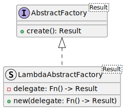
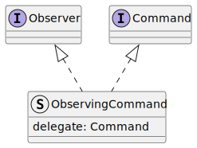

# ROOPeS
ROOPeS is a Rust Object Oriented Programming System.  This crate provides generic implementations for typical object-oriented patterns in Rust.  It is intended to be used as a cluster of utility classes for implementing OOP-architected executables.

## Goals
This package intends to meet the following criteria:

- Provide implementations of common OOP Design Patterns usable to compose larger programs.
- Document and implement reference implementations for students of OOP and Rust.
- Be easy to use.

## Non-Goals
- Speed.

# Implemented Patterns
## Command

## Observer

## Abstract Factory

## Builder

## Heap Pool

## Crosscutting Patterns

### Command Observer

## Primatives

## Executable