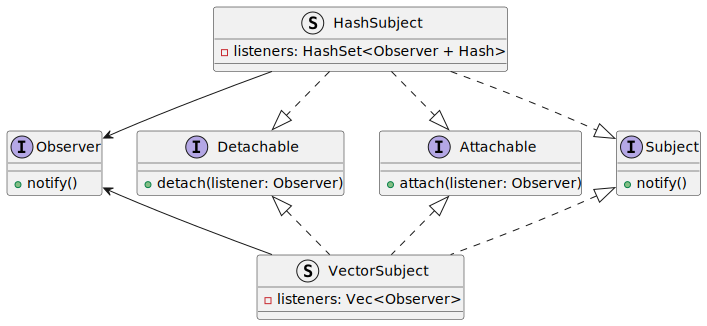

# ROOPeS
ROOPeS is the Rust Object Oriented Programming System.  This crate provides basic implementations for typical object-oriented patterns in Rust.

# The Name
The name is context-dependent, much like the patterns you might choose to employ in your program.

## Feeling Generous

# Why is there an 'e'?

# Implemented Patterns
## Command

## Observer

